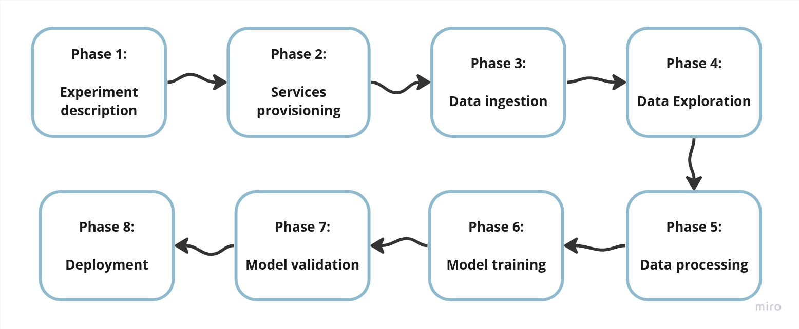
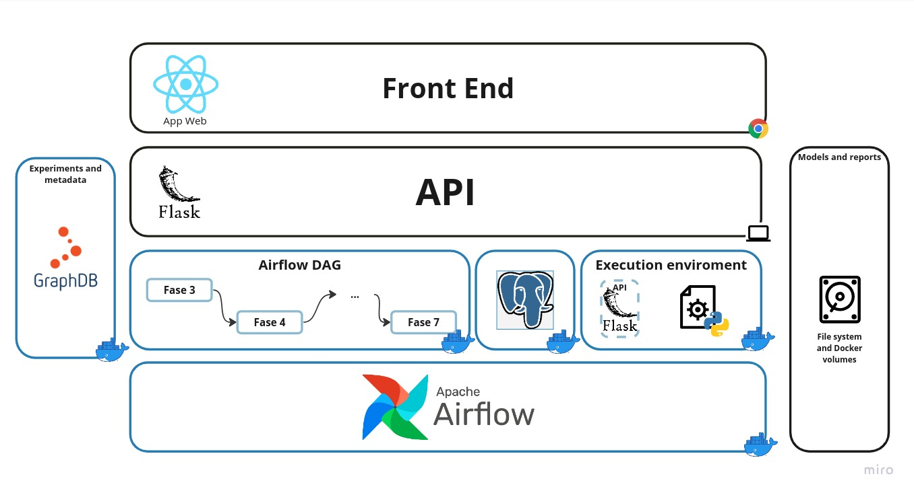

# MLOps platform prototype

Repository of the project made as tesis to obtain the System's Engieneer degree at [Universidad de Cuenca](https://www.ucuenca.edu.ec/). Developed in collaboration by [MashiPe](http://github.com/MashiPe) and [seaman69](https://github.com/seaman69) and supervised by [Victor Saquicela](https://orcid.org/0000-0002-2438-9220). The whole document (spanish) can be found [here](http://dspace.ucuenca.edu.ec/handle/123456789/41969).This is just a prototype of a platform to perform machine learning experiments. The platform automates the experimentation process using the MLOps paradigm as foundation following the process shown in the next image:



The whole process begins with the Experiment Definition phase, in which the sequence of steps to be followed in the experiment is determined, and the dependencies and resources required for it are defined. The second phase, Resource Provisioning, involves deploying all the necessary services to carry out the experiment described in the previous phase. The phases of Data Extraction, Data Exploration, Data Processing, Model Building, and Model Validation are responsible for all data processing, from data extraction to model generation and validation. Finally, the Deployment phase will only be done locally, exposing the generated models through a REST API.

## Architecture



## Dependencies

Make sure to install all the dependencies for the project:

- Docker
- Docker-Compose
- Flask
- Python
- GraphDB

## Installation

The project depends on Docker, Docker-Compose and Flask. An installation script is provided for ubuntu-based distributions. To install all dependencies use:

```
sh installation.sh
```

This script install Docker, Docker-Compose and Python dependencies using pip. GraphDB can be downloaded from [here](https://www.ontotext.com/products/graphdb/download/). Make sure to let GraphDB run on port `7200`.

### GraphDB preparation

The platform uses web semantic technologies as data model. 

Follow the next instructions to import the ontology to GraphDB:

1. Create a new repository. To do this go to Setup > Repositories in the sidebar and create a new repository with name `mashitesis`. Make sure that the repository is running while using the platform.

2. Go to Import in the side bar and click the option `Upload RDF files` and select the file `DMProcess.owl` located at the root of the project.
3. Click the import button and fill the settings with:

    - **Base IRI:** http://www.semanticweb.org/DM/ontologies/MLOpsExp
    - Select the **Named graph** option
    - **Target graphs:** http://mlops/data
    
4. Confirm the import by clicking the import button

Now everything is ready to start using the platform

## Execution

Once everything is installed the `execute.sh` script can be used to start the program.

```
sh execute.sh
```

The web UI can be accessed on `localhost:3000`. Use the `MLOps_User_Manual.pdf` document as reference.
